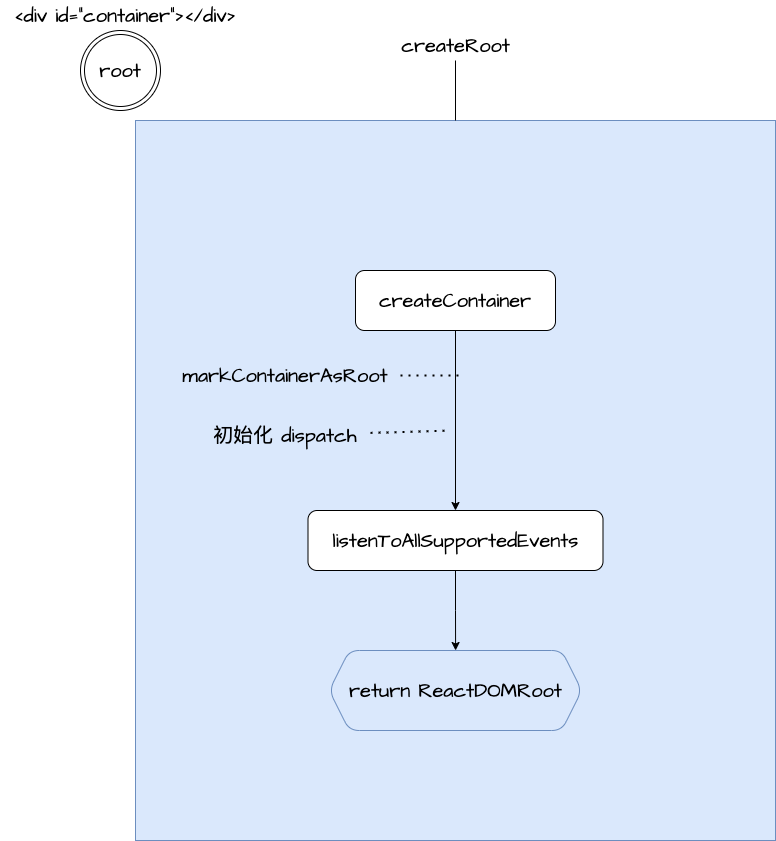

## ReactDOM.createRoot

> version 18.2.0



### 前言

每当写完 react 的代码你是否有疑问，createRoot 背后到底做了什么事情？为什么在 React 18中加入此方法？下面我们一步一步来探寻。
另外，我们也一步一步来剖析 react 的工作原理。

### 起源

该方法来自于 ReactDOM/ReactDOMClient ，说明这个方法是给客户端（浏览器）使用的，不可以在 Node 环境中使用。

### 内部

1. createContainer ---- 创建“根容器”
2. markContainerAsRoot ---- 标记/存储根容器
3. 初始化 dispatch
4. listenToAllSupportedEvents ---- 监听/注册所有支持的事件
5. 返回 ReactDOMRoot ---- 返回 ReactDOMRoot 实例

在这里，我们重点来看看 `createContainer` 和 `listenToAllSupportedEvents`。

### createContainer

首先来探索下各参数的含义或者用途，一共八个参数，我们逐个分析。

1. `containerInfo` -- 根节点元素，就是我们用来渲染 React 组件的根容器
2. `tag` -- 默认传数值 1，React 中变量名为 `ConcurrentRoot`
3. `hydrationCallbacks` -- 默认传 `null`，用户自传的渲染回调
4. `isStrictMode` -- 默认传 `false`，通过查阅官方文档得知此为严格模式，可以帮助我们开发高质量组件，并且只会在开发环境下生效，不影响生产构建。
5. `concurrentUpdatesByDefaultOverride` 仅供内部实验，这里不做分析。
6. `identifierPrefix` -- 默认传空字符，用于由 `React.useId` 生成的 ID 的前缀。在同一页面上使用多个根容器时，有助于避免冲突并且必须与服务器上使用的前缀相同。
7. `onRecoverableError` -- 默认是使用全局的 `reportError` 方法，如果浏览器不支持则会创建匿名函数内容为 `console.error(err)`，该参数是用于捕获在 React 渲染 UI 期间不影响流程的报错信息
8. `transitionCallbacks` -- 默认传 `null`，transition 相关，暂时不做分析

我们继续往下探索，可以看到在该方法中初始化了 `hydrate` 和 `initialChildren`，然后返回 `createFiberRoot` 该方法的结果。
那我们只能继续看 `createFiberRoot` 方法做了什么事情。

#### createFiberRoot

1. 创建根节点
2. 创建未初始化的 Fiber，记为 `uninitializedFiber` 并且将该变量挂载到根节点的 `current` 属性上，将根节点挂载到该变量的 `stateNode` 属性上。具体代码如下：
```js
root.current = uninitializedFiber;
uninitializedFiber.stateNode = root;
```
3. 记忆状态
4. 初始化更新队列，传入 `uninitializedFiber`
5. 返回根节点

### listenToAllSupportedEvents

> 监听所有支持的事件到跟节点上