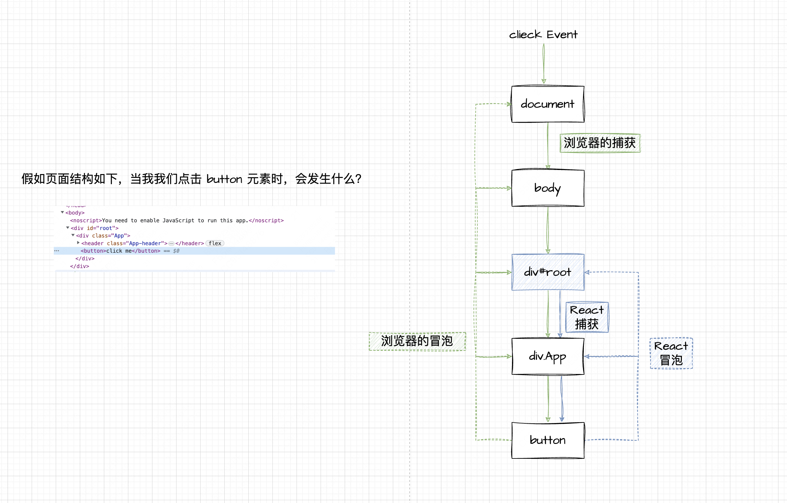

## reactEvent

> version 18.2.0

### 前言

众所周知，React 自定义了一套事件系统，那它内部到底做了什么呢？下面我们将从事件的监听、事件触发的角度出发看看，React 内部对“事件”到底做了什么。

1. 初始化，在 `creatRoot` 时对于根容器/节点（需要注意 `selectionchange` 事件是绑定到 document 上的）进行事件监听以及初始化，具体是使用 `listenToAllSupportedEvents()` 方法。

2. 事件触发，下图是事件触发的流程图

3. 批量更新，`batchUpdates()`，将事件回调加入批量更新队列

### listenToAllSupportedEvents

遍历所有事件，这些事件来源于事件插件，在事件监听之前会将事件插件中的所有事件绑定到 `allNativeEvents` 上

遍历事件时将这些事件分别以冒泡和捕获的方式进行监听，并且在绑定监听回调时区分好事件优先级（对于优先级很疑惑吧？后面我们再详细列出事件的优先级）。